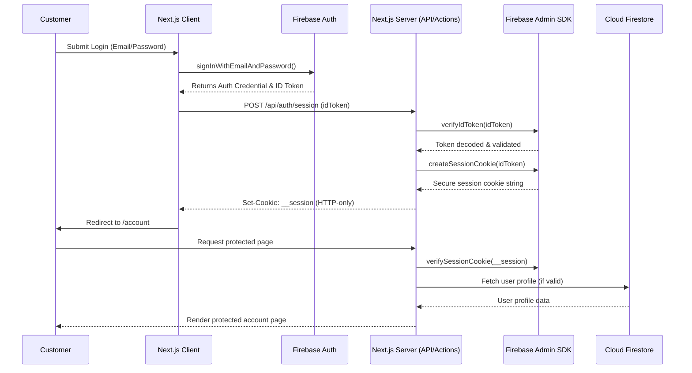

# Authentication Architecture

## Sequence Diagram

## Workflows
- **Registration**: Client SDK creates Firebase Auth account -> Client updates display name -> Server Action creates a secure profile in Firestore (idempotent) -> Email verification sent.
- **Login**: Firebase Auth provides JWT -> Passed to `/api/auth/session` -> Server issues an HTTP-only secure cookie via Firebase Admin SDK.
- **Logout**: Client POSTs to `/api/auth/logout` -> Server clears the `__session` cookie -> Client signs out from Firebase Auth.
- **Password Reset**: Uses Firebase Client SDK `sendPasswordResetEmail`.
- **Role Validation**: All backend API routes and Edge Middleware decrypt or verify the token to read `role` claims, enforcing isolation.
