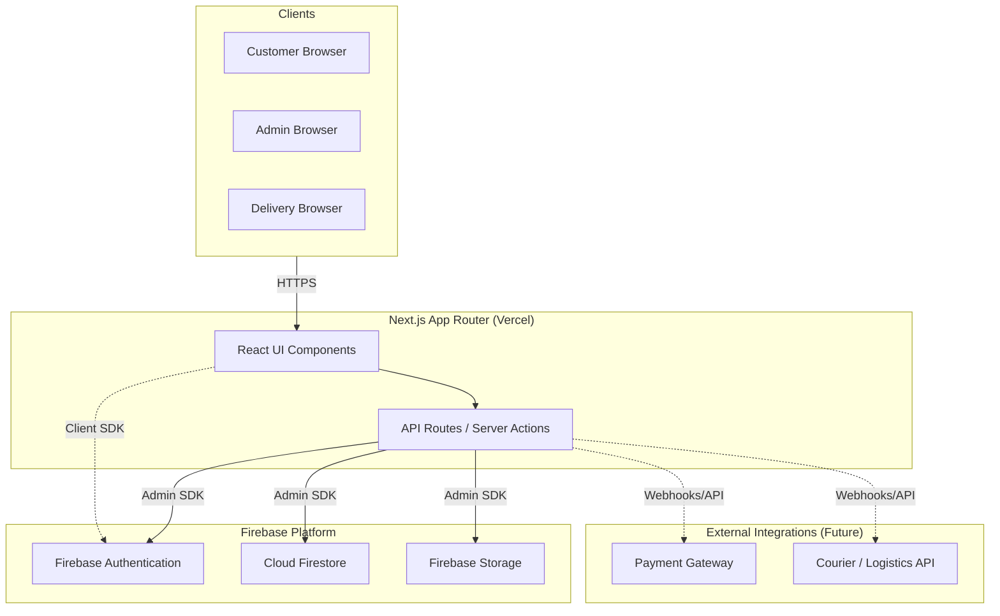

# System Architecture

## Architecture Diagram

## Security & Data Flow
- **Authentication Boundaries**: Client-side SDK handles login/session management, Server-side Admin SDK validates tokens and handles privileged operations.
- **Server-side Authorization**: Role-based access control (RBAC) via custom claims. Next.js middleware and Server Actions will verify claims before execution.
- **Storage**: Images are stored in Firebase Storage. Public access is granted to product images; restricted access for user/admin assets.
- **Payments (Future)**: Processed securely using external gateways. Webhooks will update order statuses in Firestore securely via server-only routes.
